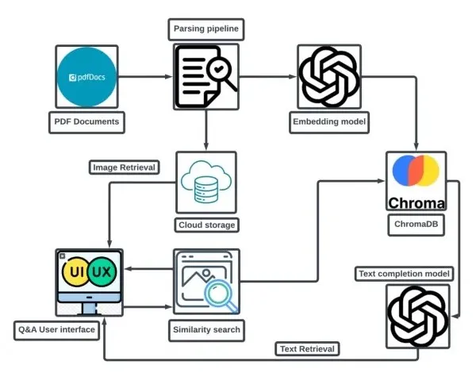

# openSource_RAG

RAG, or Retrieval-Augmented Generation, is a framework that combines traditional information retrieval techniques with generative models, such as those used in natural language processing. The main idea behind RAG is to enhance the capabilities of generative models by providing them with relevant external information retrieved from a knowledge base or document corpus.

Key Components of RAG:
1) Retrieval Component: This part of the system is responsible for fetching relevant documents or pieces of information based on a user's query. It typically uses techniques like vector similarity search or traditional keyword-based search to identify the most pertinent data.

2) Generative Component: After retrieving the relevant information, the generative model (often based on architectures like Transformers) processes this data to produce coherent and contextually appropriate responses. This allows the model to generate answers that are not only based on its training data but also informed by the latest or specific information retrieved.
3) Integration: The integration of retrieval and generation allows for more accurate and contextually relevant responses, especially in scenarios where the generative model's training data may be outdated or insufficient.

Applications of RAG:
Question Answering: RAG can be particularly effective in systems designed to answer questions by pulling in the most relevant information from a large corpus of documents.

Advantages of RAG:
1) Improved Accuracy: By leveraging external information, RAG can produce more accurate and relevant responses.
2) Dynamic Knowledge: It allows models to access and utilize information that may not have been included in their training data, making them more adaptable to new information.
3) Scalability: RAG systems can scale to incorporate vast amounts of external data, enhancing their knowledge base without needing to retrain the generative model.

Llama 2 as your main model in conjunction with Ollama embeddings for vector retrieval is a powerful approach for building a question-answering system that can effectively handle queries based on the content of PDF documents. Here’s a breakdown of how this setup works and its benefits:

1) Document Processing:
First, you need to extract text from the PDF documents. This can be done using libraries like PyPDF2, pdfplumber, or similar tools that can read and convert PDF content into plain text.
2) Embedding Generation:
Once you have the text, you can use Ollama embeddings to convert the text into vector representations. These embeddings capture the semantic meaning of the text, allowing for effective similarity comparisons.
3) Vector Retrieval:
When a user asks a question, you convert the question into an embedding using the same embedding model. You then perform a similarity search against the embeddings of the text extracted from the PDFs to find the most relevant passages or sections.
4) Answer Generation:
After retrieving the relevant text segments, you can feed this information into the Llama 2 model. The model can then generate a coherent answer based on the retrieved context, effectively combining the strengths of both retrieval and generation.

Benefits of This Approach:
- Contextual Relevance: By retrieving specific sections of text that are relevant to the user's question, the model can provide more accurate and contextually appropriate answers.
- Dynamic Knowledge Access: This setup allows the model to access information from the PDFs dynamically, meaning it can handle a wide range of topics without being limited to its training data.
- Scalability: You can easily add more documents to your system. As you add more PDFs, you simply generate new embeddings and update your retrieval system without needing to retrain the Llama 2 model.
- Improved User Experience: Users can ask specific questions and receive detailed answers based on the content of the PDFs, enhancing the overall interaction quality.

Considerations:
- Quality of Embeddings: The effectiveness of your retrieval system heavily depends on the quality of the embeddings generated by Ollama. Ensure that the embeddings capture the nuances of the text well.
- Performance: Depending on the size of your document corpus, consider optimizing your vector search for performance, especially if you have a large number of PDFs.
- Handling Ambiguity: Be prepared to handle cases where the retrieved text may not directly answer the question or where multiple interpretations are possible.